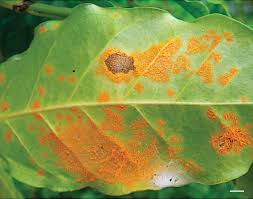

## Apresentação {style="float:right"}

O conjunto de dados será da ferrugem do café na Etiópia que está no arquivo de dados na nuvem.

## Importar os dados

Usaremos a função gsheet2tbl ( ) do pacote gsheet para carregar os dados no ambiente.

```{r}
library(gsheet)

cr <- gsheet2tbl("https://docs.google.com/spreadsheets/d/1bq2N19DcZdtax2fQW9OHSGMR0X2__Z9T/edit?gid=1871397229#gid=1871397229")

library(DT)
datatable(cr)

```

## #Gráficos

```{r}
library(rnaturalearth)
library(rnaturalearthhires)
library(ggthemes)
library(tidyverse)
#install.packages("ggspatial")
library(ggspatial)

ETH <- ne_states(country = "Ethiopia",
                 returnclass = "sf")

ggplot(ETH)+
  geom_sf(fill = "white")

#ou

ETH |> 
  ggplot()+
  geom_sf(fill = "white")+
  geom_point(data = cr, aes(lon, lat, color = inc))+
  scale_color_viridis_c()+
  theme_minimal()+
  theme(legend.position = "bottom")+
  annotation_scale(location = "tl")+
  annotation_north_arrow(location = "br", which_north = "true")+
  labs(title = "Ferrugem do café na Etiópia",
       x = "Longitude", y = "Latitude",
       subtitle = "Levantamento em fazendas",
       caption = " Fonte: Del Ponte et al., 2025",
       color = "Incidência (%)")
ggsave ("mapa_etiopia.pdf", bg = "white", width = 10)


BR <- ne_states(country = "Brazil",
                 returnclass = "sf")

BR |> 
ggplot()+
geom_sf(fill = "gray90")
```
